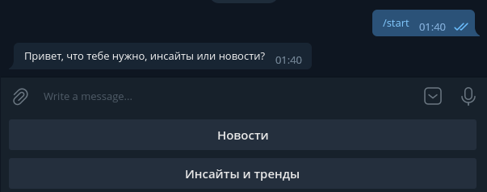

## Задание для хакатона от ВТБ по data треку

Перед началом работы, надо установить зависимости и создать виртуальное окружения для работы, при помощи этих команд в папке проекта
```shell
python -m venv venv
pip install -r requirements.txt
```
### Парсинг данных (не обязательно. собранный датафрейм и обученная модель уже есть в файлах проета)
В папке parser находятся файлы для создания csv файла. Для запуска надо перейти в директорию командой 
```shell
cd parser
```
Потом запускаем файл parsing.py командой и ждем ее окончания
```shell
python parsing.py
```
Будет создан csv_file.csv с новостями
### Обучение модели
Дальше нужно обучить модель. После обучения нужно запустить телеграм бота.  (Модель сама обучиться автоматически, если вы не сделаете этого вручную)
### Запуск телеграм бота
Из корневого каталога проекта, запускается команда
```shell
python bot.py
```
После запуска бота, нужно открыть его и начать с ним диалог при помощи команды /start. Можно запросить как инсайты и тренды, так и новости

### Пример работы бота

начало рабюоты с ботом: 


Вывод новостей: 


Вывод инсайтов: 


### Авторы:

Ксения Матвеева: data analyst, генератор идей

Дарья Матвеева: backend, data science, фундамент команды, самый азартный игрок

Павел Ломоносов: самый надежный backend
